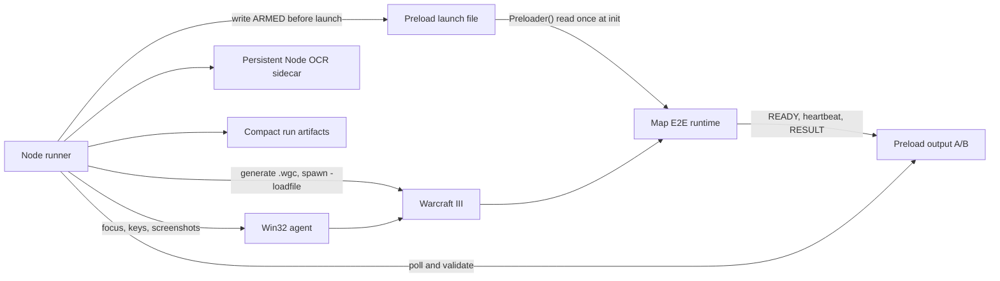

# Shared E2E Harness Plan

Status: proposed implementation plan

## Decision Summary

Build a new shared `wc3-e2e-harness` repository with these constraints:

- Node.js owns orchestration, window control, OCR, protocol parsing, timeouts, and artifacts.
- WGC remains the programmatic launch mechanism: the runner generates a `.wgc` game-configuration
  file (bundled `lua.exe wgc-launch.lua`, ported from Castle Fight) and starts Warcraft III with
  `-loadfile <map>.wgc`, which selects map, slots, and game speed without menu navigation. WGC is a
  launch artifact, not a running controller.
- The Win32 agent (ported from Castle Fight `win32-agent.ts`/`input-capture.ts`) is the only
  window-focus, keyboard, and screenshot channel.
- The shared harness has no MMD or w3gjs dependency.
- Test configuration and results use Warcraft III preload save/load files.
- Automated runs do not type chat commands.
- The map learns the suite id before normal game startup from a one-shot launch file written before
  Warcraft III spawns. There is no mid-game harness-to-game channel: once armed, the suite
  auto-starts when the game clock begins advancing, because game time cannot advance until the
  loading screen and post-load pause are actually cleared.
- Replays are optional debugging artifacts, never the result transport.
- Project repositories own their fixtures, assertions, and suite registrations.

The existing MMD/chat/replay pipeline may remain available while projects migrate, but none of it is
copied into the shared repository and there is no dual-write compatibility layer.

## Reliability Contract

The harness must:

1. Never allow ordinary game startup to race ahead of E2E setup.
2. Never pass a run using stale, partial, corrupt, or differently identified output.
3. Never depend on OCR to determine whether a test passed.
4. Never wait for a broad timeout after a terminal result or process exit is already known.
5. Recover from the known post-loading-screen pause deterministically.
6. Bound every recovery attempt and fail with useful evidence instead of hanging.
7. Keep terminal output compact while retaining detailed artifacts on disk.

Robustness means both successful recovery from known Warcraft III behavior and prompt, well-explained
failure when the state cannot be recovered.

## Environment Prerequisites

The harness targets exactly this environment; anything outside it is out of scope for version 1:

- Windows 10/11 with an interactive desktop session. Screenshots and posted key events require a
  visible window, so headless CI runners cannot execute native suites.
- A retail Warcraft III Reforged install, auto-detected from the standard install paths or supplied
  via configuration.
- Exactly one Warcraft III instance. The runner refuses to start while any Warcraft III process
  exists and never attaches to a pre-existing one.
- Node.js LTS for the runner and the OCR sidecar (tesseract.js plus the English traineddata).
  ImageMagick is optional preprocessing; when unavailable the sidecar falls back to raw frames with
  a single warning.
- The bundled `lua.exe` and `wgc-launch.lua` for WGC generation.
- `CustomMapData` lives under whichever Documents directory Warcraft III actually uses, including
  OneDrive-redirected variants. The harness resolves candidates the same way replay detection does
  today and records the resolved root in `run.json`.

## Architecture



### Shared harness responsibilities

- Build and launch configuration.
- WGC file generation and the Warcraft III process lifecycle.
- Win32 agent keyboard input and screenshot capture.
- Window discovery, foreground checks, and focus recovery.
- `CustomMapData` root discovery.
- Loading-screen detection and advancement.
- Mandatory F10 open/close unpause sequence.
- File protocol encoding, polling, validation, and cleanup.
- Explicit lifecycle state machine and per-state deadlines.
- OCR sidecar process management.
- Dialog recovery and failure evidence.
- Immediate terminal-state handling and bounded clean quit.
- Compact console output and structured artifacts.
- Reusable Wurst E2E runtime.

### Project adapter responsibilities

- Hook the E2E runtime into the earliest map initialization point.
- Suppress normal setup (dialogs, seeds, timers) by gating it on `E2E.isActive()` while an
  authenticated E2E run is armed.
- Register stable suite ids.
- Create in-game fixtures.
- Emit domain events and assertions.
- Return a final pass/fail result.
- Optionally expose short chat aliases for manual developer use only.

## Run Lifecycle

The runner uses an explicit state machine:

```text
PREPARE -> LAUNCH -> WINDOW -> LOADING -> UNPAUSE
        -> READY -> RUNNING -> RESULT -> QUIT -> COLLECT
```

States are runner-side confirmations, not a strict wall-clock ordering of map events. The map emits
`READY` during map initialization, which normally happens while the loading screen is still on
screen — so the runner may observe the `READY` snapshot at any point after LAUNCH and simply records
it. The READY state means "READY confirmed"; RUNNING means a valid `RUNNING` snapshot plus an
advancing heartbeat have been observed, which is also the proof that the unpause sequence worked.

Every state has:

- entry evidence;
- a narrow deadline;
- allowed recovery transitions;
- a maximum attempt count;
- artifacts captured on failure.

### 1. Prepare

Before Warcraft III starts, Node:

- refuses to run while any Warcraft III process already exists;
- creates a unique run id and random nonce;
- removes or invalidates stale launch/output files for that run location;
- writes the one-shot `ARMED` launch file containing project id, build id, protocol version, suite
  id, run id, and nonce;
- starts the persistent OCR sidecar;
- starts polling the output channel before launch.

Suite ids are short, stable ASCII identifiers such as `bs-1` or `za-1`. The display name and timeout
live in a manifest; the id is not asked to carry descriptive text.

### 2. Early map barrier

The map reads the launch file during its earliest initialization hook. A valid `ARMED` message:

- enables E2E mode;
- suppresses biome selection, seed selection, ordinary timers, and other normal startup;
- loads the named suite without executing it;
- emits `READY`;
- schedules the suite to start on the first game-time tick.

Because normal startup is suppressed at initialization time — before any launch speed can matter —
there is no window in which ordinary setup races ahead of E2E setup. This is the central protection
against 8x and faster launch races. The suite body itself needs no further gate: it runs on
game-time timers, and game time cannot advance until the loading screen and the post-load pause are
cleared, so an armed suite is frozen exactly as long as the runner is still working on unpause.

### 3. Loading screen and unpause

After the loading screen is ready, Node:

1. foregrounds the Warcraft III window;
2. sends Space to leave the loading screen;
3. waits for an in-game visual signal;
4. foregrounds the window again;
5. always sends F10, waits for menu confirmation or a short settle interval, then sends F10 again;
6. confirms that the expected game state is visible.

The F10 open/close sequence is mandatory for every suite, not a retry used only after a timeout.

If the sequence is inconclusive, the runner repeats the bounded focus recovery sequence. It never
uses coordinate-based clicks.

### 4. Suite auto-start

On the first game-time tick after initialization — which by definition means the game is unpaused
and simulating — the map:

- emits `RUNNING` immediately;
- starts the fixture;
- emits periodic heartbeats while active.

The runner considers the game genuinely running only after it observes a valid `RUNNING` snapshot
and an advancing heartbeat. A visible game screen by itself is insufficient, and the advancing
heartbeat doubles as the confirmation that the unpause sequence succeeded. There is no runner
acknowledgement in the other direction: once the game is running, the runner's only channels into
it are keyboard input (recovery, quit) and process termination. Consequence: there is no mid-run
abort or stepping — cancelling a run means quitting the process, which is already the quit path.

### 5. Result and quit

The map emits one durable terminal snapshot:

- `PASS` with assertion totals and compact summary; or
- `FAIL` with failed assertion ids and compact diagnostics.

On the first valid terminal snapshot, Node immediately begins the quit sequence. It does not wait for
OCR, replay creation, a heartbeat, or the suite timeout.

If Warcraft III exits first, the runner classifies the run from the latest valid matching snapshot.
An exit without a complete terminal snapshot is a failure.

## File Protocol

### Location

Use a dedicated subdirectory below Warcraft III `CustomMapData`, separated by project:

```text
CustomMapData/wc3-e2e/<project-id>/
  armed.pld
  output-a.pld
  output-b.pld
```

The launch file (`armed.pld`) is written exactly once, before Warcraft III spawns, and read exactly
once at map initialization — writer and reader never overlap, so it needs no alternation. Output
uses alternating `A` and `B` files because Node reads while the game writes. Writers never rely on
appending. `.pld` follows the stdlib `FileIO` convention; Spike 0 confirms subdirectory behavior
below `CustomMapData`.

### Transport mechanics

The map side uses the Wurst standard library exclusively: `FileIO` (with `ChunkedString`) already
implements chunking, the tooltip round-trip, and the preload breakout encoding. The shared Wurst
runtime writes with `new File(path)..write(...)` and reads with `readAsString()`; it contains no
preload encoding of its own. The single on-disk format is therefore **the stdlib `FileIO` format**,
in both directions:

- Files are executable preload scripts. Each 200-character chunk (`DEFAULT_CHUNK_SIZE`) is carried
  by a `call BlzSetAbilityTooltip('<FILE_IO_ABIL_ID>', "<chunk>", <level>)` line inside stdlib's
  `Preload` breakout wrapper, up to `CHUNKS_PER_FILE = 64` levels, giving a ~12.8 KB ceiling per
  file — far above any snapshot's budget.
- The map reads a file by executing it (`Preloader`) and collecting tooltip levels until the `" "`
  terminator; it writes through `PreloadGenClear`/`Preload`/`PreloadGenEnd`. Paths are relative to
  `CustomMapData`.
- Node implements exactly one reader and one writer for this format. The reader parses exactly
  what stdlib `File.write` produces (breakout wrapper included). The writer emits minimal clean
  JASS — a `PreloadFiles` function of `BlzSetAbilityTooltip` calls — which stdlib `readAsString()`
  consumes without special map-side code (spike-verified; byte-mimicry of `PreloadGenEnd` output
  is unnecessary). Shared test vectors (same fixture files asserted in the Node tests and in a
  Wurst unit test) keep the two implementations in lockstep.
- `FILE_IO_ABIL_ID` is a stdlib `@configurable`; Zombie Defense already overrides it to `AM04`.
  The project manifest carries the same rawcode so Node can embed it in generated files — a
  mismatch between manifest and map config means the launch file reads back empty, which surfaces
  as a missing `READY` within the Ready deadline, never as a silent wrong-suite run.
- The launch file is complete on disk before the process starts, so it has none of the
  concurrent-write hazards of the output channel. A missing, stale (wrong run id/nonce), or
  malformed launch file means E2E mode never arms and the map boots normally.

Encoding rules on top of the stdlib format:

- Stdlib `FileIO` rejects `"` and `\` in content outright (`validateInput`), so the envelope and
  payload never contain them: reserved characters are transposed with a fixed substitution table
  (for example `"` → `~q`, `\` → `~b`, `~` → `~~`) applied after JSON serialization and reverted
  before parsing.
- `payloadChecksum` is FNV-1a 32-bit over the decoded payload, implemented once in Wurst and once
  in Node, covered by the same shared test vectors. No dependence on engine hash natives.
- `buildId` is minted by the runner at build time and passed in `ARMED`; the map echoes it. Actual
  map-version identity is enforced by launching a content-hash-suffixed copy of the freshly built
  map (the existing WGC input-map hashing), not by trusting the echo.
- Stdlib's `CAN_READ_FILES` init self-test (write `FileTester.pld`, read it back) is re-exported by
  the runtime and included in the `READY` payload, so a machine where preload reads are broken
  fails loudly at READY instead of hanging later.

### Snapshot envelope

The envelope below applies to output snapshots. The launch file carries only the identity subset —
protocol version, project id, build id, run id, nonce, suite id — plus its own checksum; it has no
sequence, game time, or heartbeat because it is written once before the game exists.

Each output snapshot contains:

```text
protocolVersion
projectId
buildId
runId
nonce
suiteId
sequence
state
gameTime
heartbeat
payloadChunkCount
payloadChecksum
complete
```

The payload is compact JSON, transposed through the substitution table and carried in stdlib
`FileIO` chunks. Node parses the stdlib wrapper, joins the chunks, verifies the declared chunk
count and checksum, reverts the substitution, then parses JSON.

A reader accepts a snapshot only when:

- the wrapper is syntactically complete;
- `complete` is true;
- all identity fields match the active run;
- the sequence is newer than the last accepted sequence;
- all chunks are present;
- the checksum matches;
- the state transition is legal.

Of the two alternating files, the reader chooses the highest fully valid matching sequence. A
truncated newer write cannot hide an older valid snapshot.

### Flush policy

Flush immediately on:

- `READY`;
- `RUNNING`;
- assertion failure;
- phase transition;
- terminal `PASS` or `FAIL`.

Flush heartbeats at a bounded game-time interval. The map only has game time; the runner converts
the configured speed multiplier into the expected wall-clock heartbeat cadence and derives the stall
deadline from that, so one heartbeat interval serves every speed without producing large files.

Game time stops while the F10 menu or a pause is open, so heartbeats legitimately stall in states
the runner itself causes. Stall detection is suspended while the runner is inside an intentional
menu interaction, and the recovery ladder treats "menu visible plus stalled heartbeat" as a
recoverable pause before treating it as suite failure.

Routine domain events are aggregated in memory and emitted as counters or bounded recent-event
windows. Full unbounded traces are forbidden.

## Focus and Dialog Recovery

OCR is advisory. It helps classify screens and choose recovery actions, but file state remains the
test authority.

### Recovery ladder

When expected progress stalls:

1. Check whether the Warcraft III process and window still exist.
2. Re-read both output snapshots.
3. Foreground Warcraft III.
4. Send Escape once to dismiss chat or a dismissible modal.
5. Perform F10 open/close.
6. Wait for an advancing heartbeat.
7. Repeat the ladder only up to the configured attempt limit.
8. Fail fast and collect evidence if progress remains stalled.

### Unexpected UI policy

- Known loading, menu, game-over, disconnect, and error dialogs receive explicit classifiers.
- If an unknown visual appears while heartbeats advance, continue and save one diagnostic screenshot.
- If an unknown visual appears and heartbeats stall, run the bounded recovery ladder.
- Fatal Warcraft III dialogs fail immediately.
- Recovery actions and classifier confidence are recorded in the timeline.

No unexpected dialog may extend a run indefinitely.

## End-of-Game Handling

Terminal evidence is processed in this order:

1. Valid file `PASS` or `FAIL`.
2. Warcraft III process exit.
3. Recognized game-over/error visual.
4. Heartbeat stall.
5. Per-state deadline.

The clean quit sequence is bounded and starts as soon as terminal evidence is known:

- foreground the window;
- send Alt+F4 — with replays out of the result path there is nothing to preserve, so no menu
  navigation (the old F10/End-Game route existed only to make `LastReplay.w3g` flush);
- confirm process exit;
- force-terminate every remaining Warcraft III process (the `-launch` flow can leave a second pid
  that would block the next run) — only after result artifacts are durable.

If clean quit exceeds its budget, the runner may terminate the process only after result artifacts are
durable. The result records whether shutdown was clean or forced.

Seeing a game-over screen before a terminal file result causes an immediate failed collection/quit
path. The runner must not sit on that screen until the suite's global timeout.

## Timeouts

Use separate deadlines rather than one large timeout:

| Phase | Deadline purpose |
| --- | --- |
| Launch | Warcraft III process appears |
| Window | Expected main game window is controllable |
| Loading | Loading screen can be advanced |
| Unpause | In-game screen and F10 cycle complete |
| Ready | Matching map runtime has armed |
| Running | `RUNNING` snapshot and first heartbeat after unpause |
| Heartbeat | Active suite continues to make progress |
| Suite | Scenario-specific maximum runtime |
| Quit | Warcraft III exits after terminal result |
| Collect | Artifacts and protocol snapshots are persisted |

The RESULT state needs no deadline of its own: it is bounded by the Suite deadline and by the
heartbeat stall deadline. The suite manifest owns the scenario timeout. Terminal state, process exit, or fatal dialog always
short-circuits the remaining deadline.

## Node Process Model

- One Node runner is the parent process.
- Warcraft III is spawned detached with `-loadfile <generated .wgc>`; the WGC generator
  (`lua.exe wgc-launch.lua`) is a bounded one-shot subprocess, not a resident controller.
- The Win32 agent is the only focus/keyboard/screenshot channel; coordinate-based clicks stay
  forbidden.
- OCR runs in a persistent Node sidecar or worker so model startup is paid once.
- Replay copying, screenshots, and artifact writes stay in Node.
- The shared runner is plain Node (current LTS). The Castle Fight lifecycle modules are
  Deno-flavored TypeScript (`import.meta.dirname`, `Deno.exit`); they are ported to Node during
  migration, never imported across repos. Deno is not on the launch, OCR, protocol, result, or quit
  path.
- Sidecar messages use request ids and explicit deadlines.
- A crashed OCR sidecar is restarted once; repeated failure ends the run with evidence.
- Runner exit codes are stable: `0` suite passed, `1` suite failed or produced no valid terminal
  snapshot, `2` infrastructure/configuration failure before a verdict was possible.

## Wurst Runtime API

The shared dependency should expose a deliberately small API:

```wurst
E2E.register("za-1", () -> runFarHoleScenario())     // suite body, runs on first game-time tick
E2E.isActive()                                       // adapters gate normal startup on this
E2E.assertTrue("wall-focus-retained", condition)
E2E.recordEvent("target-change")   // "event" is a JASS native type name
E2E.finish()
```

The runtime is built on stdlib `FileIO`/`ChunkedString` and needs no file-IO configuration of its
own: projects already override the stdlib `FILE_IO_ABIL_ID` `@configurable` (Zombie Defense uses
`AM04`), and the manifest mirrors that rawcode for the Node side.

`E2E.isActive()` becomes true during the earliest initialization hook when a valid `ARMED` launch
file is read, before any registered suite runs. The runtime invokes the registered closure on the
first game-time tick — projects never implement their own start gate.

The runtime owns:

- reading and validating the launch file;
- `ARMED`, `READY`, and `RUNNING` state;
- snapshot sequencing and alternating output files;
- heartbeat emission;
- assertion totals;
- bounded event aggregation;
- one terminal result.

Project code must not implement its own file encoding or lifecycle handshake.

## Artifacts

Each run writes:

```text
artifacts/<project>/<run-id>/
  run.json
  result.json
  timeline.ndjson
  protocol/
  screenshots/
  ocr.ndjson
  wc3.log
  replay.w3g          # optional
```

Console output is limited to state transitions, recoveries, terminal result, and artifact location.
OCR text is recorded only when its classification changes or recovery begins. Protocol snapshots are
retained in files but summarized in the console.

## Test Strategy

### Pure Node tests

- alternating-file selection;
- stale run id and nonce rejection;
- partial/truncated preload writes;
- missing and reordered chunks;
- checksum mismatch;
- illegal state transitions;
- duplicate and out-of-order sequences;
- immediate terminal-state cancellation;
- sidecar timeout, crash, and restart;
- compact artifact limits.

### State-machine simulations

- Space does not unpause the game;
- Warcraft III loses focus before or after Space;
- the first F10 event is lost;
- an unknown modal appears;
- a game-over screen appears before a result;
- the process exits before, during, or after result emission;
- heartbeat stalls while the process remains alive;
- a stale output file exists from a prior run;
- terminal result arrives while OCR is busy.

### Native canary suites

The shared repository includes a tiny canary map/adapter that can:

- emit `READY`, auto-start on the first game-time tick, heartbeat, pass, and fail;
- intentionally stop heartbeats;
- intentionally delay result;
- expose a recoverable paused/menu state;
- finish immediately to test prompt quit.

Project-native suites then validate real fixtures such as zombie far-hole, near-breach, and
ranged-wall behavior.

## Release Gates

Version 1 is not released until:

- all protocol and state-machine tests pass;
- no run can pass without a complete, matching, checksummed terminal snapshot;
- 100 consecutive mixed-speed canary runs complete with zero hangs and zero normal-startup races;
- the matrix includes 1x, 6x, and 8x, plus 10x if the canary sustains it (Castle Fight experience:
  unit-heavy scenes cannot sustain 8x and degrade into lag, but the tiny canary map is expected to);
- injected focus loss and post-Space pause recover reliably;
- unknown stalled dialogs fail with evidence within the configured short stall budget;
- terminal result starts quit handling immediately;
- artifact size remains bounded during a long-running failure;
- both Zombie Defense and Castle Fight complete at least one migrated native suite.

Any flaky release-gate run resets the consecutive-run count after the defect is fixed.

## Migration Plan

### Phase 0: Transport spike

Stdlib `FileIO` already answers the format questions (200-char chunks, 64 levels, forbidden `"`
and `\`, `.pld` convention, `CAN_READ_FILES` self-test). What today's pipeline never exercises is
**a map reading, via stdlib `readAsString()` at initialization, a file that Node wrote — not the
game itself — into a `CustomMapData` subdirectory before launch.** Verify with a throwaway map on
the current retail patch and record results in the shared repository docs:

1. Node-written launch file: generate the stdlib-byte-compatible file, launch, and confirm the map
   reads all chunks back during its earliest initialization hook.
2. Subdirectory behavior below `CustomMapData`: the map can write to and read from
   `wc3-e2e/<project-id>/`, and Node-created directories are readable by the game.
3. Heartbeat write frequency and file sizes at 8x/10x game speed.

Exit: the transport facts above are documented with the patch version they were verified on. If the
launch-file read fails outright, the fallback is injecting the suite id at build time (a generated
Wurst constant per run), which trades a rebuild per suite for zero file reads; decide only after
the spike.

### Phase 1: Shared repository skeleton

- Create `wc3-e2e-harness` as a public repository: a valid Wurst project with the Node package
  beside it.
- Confirm consumption end to end: a consumer map builds in CI with the `wurst.build` git
  dependency and installs the runner via a SHA-pinned npm git dependency, no credentials anywhere.
- Add Node runner, strict configuration schema, lifecycle state machine, and compact artifact writer.
- Add unit tests and simulation clock.
- Define project and suite manifests.

Exit: lifecycle simulations are deterministic and do not require Warcraft III.

### Phase 2: File protocol and Wurst runtime

- Implement the one-shot launch file and alternating preload output snapshots.
- Add identity, sequence, chunk, completion, and checksum validation.
- Implement early `ARMED` barrier, `READY`, game-time auto-start, heartbeat, and terminal result.
- Add corruption and stale-file tests.

Exit: Node and the canary Wurst runtime round-trip all states without MMD or w3gjs.

### Phase 3: Warcraft lifecycle hardening

- Port only the confirmed WGC programmatic interaction from Castle Fight.
- Add persistent Node OCR.
- Implement mandatory Space plus F10 open/close.
- Add heartbeat-based unpause confirmation.
- Add bounded dialog recovery and prompt terminal quit.

Exit: native canary meets the consecutive mixed-speed run gate.

### Phase 4: Zombie Defense adapter

- Add the earliest E2E bootstrap hook.
- Block normal setup while `ARMED`.
- Register compact zombie suite ids.
- Port far-hole, near-breach, and ranged-wall fixtures and assertions.
- Replace replay assertions with map-side structured results.

Exit: all zombie scenarios pass from a clean build at accelerated speed with bounded artifacts.

### Phase 5: Castle Fight adapter

- Move its reusable lifecycle/OCR logic behind the shared APIs.
- Port suites to pre-launch suite selection and the file protocol.
- Keep map-specific setup and assertions in Castle Fight.

Exit: Castle Fight no longer owns a duplicate orchestration pipeline.

### Phase 6: Remove legacy paths

- Remove shared assumptions about chat commands.
- Remove project E2E dependence on MMD, replay extraction, and w3gjs.
- Remove duplicated OCR and WGC wrappers after migrated suites are green.
- Keep replay capture only as an optional artifact.

Exit: one shared runner and protocol are authoritative in both projects.

## Planned Repository Layout

The repository root is a valid Wurst project so grill picks it up as a dependency, and the Node
runner lives beside it as an npm package. One repo, one commit, both halves of the protocol — the
Wurst runtime and the Node reader/writer can never drift apart within a pinned version.

```text
wc3-e2e-harness/
  wurst.build            # valid Wurst project: depends on wurstStdlib2
  wurst/                 # only the shared runtime packages (this is what dependents compile)
    E2E.wurst
    E2EProtocol.wurst
  node/                  # npm package: runner, lifecycle, protocol, window, artifacts
    package.json
    src/
    sidecars/
      ocr/
    test/
  canary/                # separate Wurst project (own wurst.build) for the canary map
  docs/
```

The canary map sits outside the root `wurst/` folder so dependents never compile canary fixtures;
only `wurst/` is contributed to consumers through dependency resolution.

## Distribution

Decision: the repository is **public for now**. grill does not accept local-path dependencies, so
the private submodule route would have required toolchain changes; a public repo makes the
standard mechanisms work unauthenticated everywhere, including CI.

- **Wurst side.** Consumers add the repo as an ordinary `wurst.build` git dependency; grill
  contributes the root `wurst/` packages to the map build with no credentials involved.
- **Node side.** Consumers pin an npm git dependency to a commit
  (`github:<owner>/wc3-e2e-harness#<sha>`) — or a published package later — plus a thin `e2e/run`
  entry point that supplies the project manifest. Projects never fork runner code.
- **Lockstep.** The npm side pins a SHA, but grill dependency resolution tracks the repository
  head, so the two halves *can* drift in a consumer. The runner's protocol-version check is
  therefore the enforcement, not a formality: the map's `READY` reports the Wurst runtime's
  protocol version and the runner refuses a mismatch. Discipline on the repo side: any protocol
  change bumps the version and lands as one commit, the default branch stays releasable, and
  consumers bump their npm pin together with rebuilding the map.
- **If it goes private later**, this section gets revisited — the constraint was CI/dev-machine
  authentication inside grill's dependency resolution, not anything in the harness design.
- The project manifest is a checked-in JSON file per project:

```jsonc
{
  "projectId": "zombie-defense",
  "fileIoAbilityId": "AM04",   // must match the map's FILE_IO_ABIL_ID @config override
  "build": { "command": "grill build Zombie_Defense_02-folder.w3x --dev" },
  "suites": {
    "za-1": { "name": "zombie far-hole", "timeoutMs": 120000 },
    "za-2": { "name": "zombie near-breach", "timeoutMs": 120000 }
  }
}
```

The runner validates the manifest against a strict schema before doing anything else and fails with
exit code `2` on any unknown or missing field.

## Implementation Order

The critical path is:

0. Phase 0 transport spike (the only step allowed to invalidate the design).
1. Protocol parser/writer tests.
2. Lifecycle simulation tests.
3. Wurst runtime and early startup barrier.
4. Canary native round trip.
5. Focus/unpause recovery.
6. Terminal-state and dialog handling.
7. Zombie Defense migration.
8. Castle Fight migration.
9. Soak testing and legacy removal.

This order keeps Warcraft III interaction behind already-tested state and protocol boundaries, so a
native failure produces a small, classifiable problem instead of an opaque end-to-end timeout.
